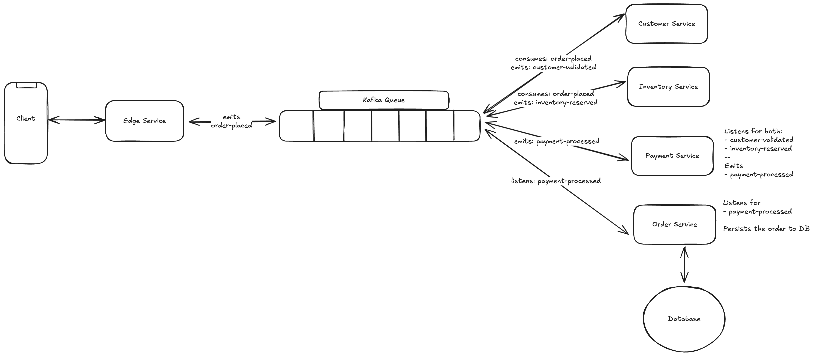

# Event-Driven Order Management System

An event-driven microservices-based Order Management System built with **Spring Boot**, **Kafka**, and **PostgreSQL**.  
The system demonstrates asynchronous order processing using domain events between microservices.

---

## 🚀 Architecture

The system consists of:

1. **edge-service** — API gateway for order requests, accepts paced order and emits "order-placed"
2. **customer-service** — Validates the customers and publishes events - "customer-validated"
3. **inventory-service** — Manages product inventory - emits "inventory-validated"
4. **payment-service** — Handles payment processing - "payment-processed"
5. **order-service** - listens to payment update and persists the order in DB
6. **Kafka & Zookeeper** — Event streaming backbone

Communication between services happens via **Kafka topics**.




## 🧪 Example Flow

1.	Client places order via /api/orders on edge-service.
2.	edge-service publishes OrderPlacedEvent.
3.	customer-service and inventory-service consume OrderPlacedEvent and validate independently.
4.	If successful:
-	customer-service publishes CustomerValidatedEvent
-	inventory-service publishes InventoryReservedEvent
5.	payment-service listens for both events and then processes the payment.
6.	On success, payment-service publishes PaymentProcessedEvent.
7.	order-service consumes this event and persists the final order.
---

## 🛠 Tech Stack

- **Java 17**
- **Spring Boot 3**
- **Apache Kafka**
- **H2 / PostgreSQL**
- **Docker & Docker Compose**
- **Maven**

---

## 📂 Project Structure

```
order-management/
├── common-models/
├── edge-service/
├── customer-service/
├── inventory-service/
├── payment-service/
├── order-service/
├── docker-compose.yml
└── README.md
```

---

## 🐳 Running with Docker Compose (Recommended for full stack)

To start **all services + Kafka** together:

```bash
docker-compose up --build
```

### Service URLs
- Edge Service: `http://localhost:8090`
- Kafka: `kafka:9092` (inside Docker network)

---

## 📜 Spring Profiles

We use Spring profiles to avoid `localhost` issues inside Docker.

| Profile  | Kafka Bootstrap Server |
|----------|------------------------|
| `dev`    | `localhost:9092`       |
| `docker` | `kafka:9092`           |

Example:
```bash
# Run locally
./mvnw spring-boot:run -Dspring-boot.run.profiles=dev

# Run inside Docker
SPRING_PROFILES_ACTIVE=docker java -jar app.jar
```
---

## Example Command to initiate the flow

```
curl --location 'localhost:8090/orders' \
--header 'Content-Type: application/json' \
--data '{
    "customerId": "OMS-Cust-001",
    "totalAmount": 2599.99,
    "productIds": [
        "item1",
        "item2"
    ]
}'
```
---
## 📌 Future Improvements
- Add centralized configuration service (Spring Cloud Config)
- Add observability (Prometheus, Grafana, Zipkin)
- Add integration tests for Kafka flows
- Secure APIs with OAuth2/JWT

---
